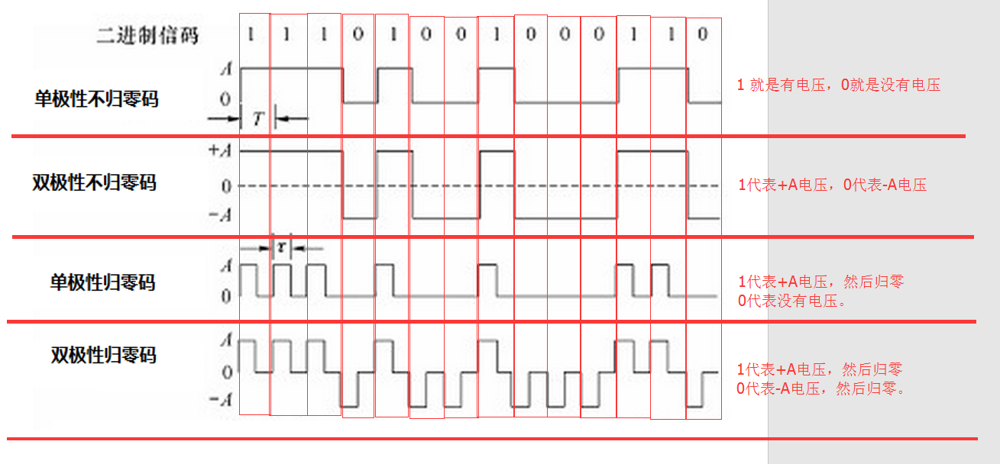
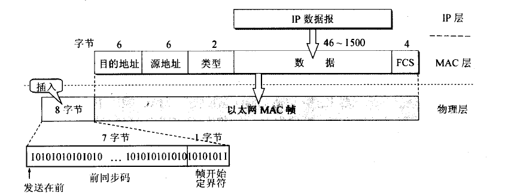

# 14.1 俗话网络通信

&emsp;&emsp;话说最近幼儿园大班里来了一位女同学，叫风玲草同学，恰逢周末，MT同学在家也很无聊，也很喜欢新来的风玲草同学，所以想约风玲草同学去游乐场玩，但是因为MT同学比较小（小就是还没有发育完全的意思），必须经过父母的同意，那在这里，MT同学的父母就是网关（gateway），所有我们要发送出去的数据都必须经过网关，有了网关后，网关要知道把数据发到哪里去，也就是MT同学的父母要知道风铃草同学的电话号码，哦，不对，因为风玲草同学也比较小，她那边也要有一个网关（也就是她的父母，在此就是她父母的电话）。MT同学哭闹一定马上要去和风铃草同学玩，MT的父母很无奈，因为不知道风玲草同学父母的电话，但是他们知道幼儿园班主任的电话号码，于是打电话问班主任风铃草同学父母的电话号码，在此，班主任就是我们的DNS服务器（域名服务器，网络上所有要通信的主机就必须把自己的IP地址和对应的域名注册到DNS服务器），因为班主任这里登记了所有同学的父母联系电话和家庭住址等等信息。  
&emsp;&emsp;有了风铃草同学父母的电话号码，MT同学父母开始拨号给她们，我们看起来一个很简单的拨号，实际上是有电话局接通了MT家里的电话信号和风玲草同学家里的电话信号，让她们之间能够相互连通信号，这里电话局就是我们通信网络上的交换设备，传输信号的电话线就是我们的同轴光缆，有了网络上的交换设备和光缆，我们网络之间的通信才变成了可能。当然在这个网络上通信就像我们打电话一样，需要一个电话号码，而网络上就是一个IP地址。
&emsp;&emsp;上文中提到了IP地址，IP地址是用来标识一台主机的（电脑）或者称网络设备吧，最初我们的IP地址是4个字节的（也就是我们常见的xxx.ooo.fff.kkk），后来我们网络上通信的设备和主机越来越多，发送4个字节不够用了，于是诞生了IPV6的编址技术，也就是IP地址用6个字节表示。那有了IP地址来标识主机是不是就够了呢？也不是的，因为我们的网络是分层的也是分范围的（比如局域网A和局域网B），比如我们的IP地址是192.168.1.109，那么这个IP地址，我们可以经常变换，比如从192.168.1网段的局域网迁移到192.168.2.子局域网的时候，我们就需要修改IP地址为192.168.2.109，这样才能成为192.168.2的子局域网中的一台主机与其他的主机通信。既然IP地址容易变换，所以我们一个不太经常变换的地址来标识主机，以便于那些网络上的交换设备能够找到它，这个就是MAC地址，一般MAC地址在设备出厂的时候就设置了（其实MAC地址可以修改，其实有了IP地址为什么还要MAC地址的这段表述不是很严谨）。  
&emsp;&emsp;Oh，继续我们的那个风铃草和MT同学要好好玩耍的故事，电话局接通了两个家里的电话信号，此时MT同学父母开始讲话了“喂，您好，是风铃草父母吗？”这段话，是怎么发送到风铃草同学父母那的呢？我们都知道同轴光缆只能传输光信号，光信号与我们0和1的编码就像如下所示：  

我们要传输的任何内容都会转化成二进制的比特流，这个二进制流会经过类似我们电话系统中的调制解调器一样，转换成光信号。对端再反调解析就行了，当然我们可以使用光缆（比如海底光缆）传输信号，也可以使用电缆传输信号（比如我们的网线），只不过后者有信号衰减，中间需要安装一个特殊的设备就是中继器，事实上，我们也不会用电缆传输很远，一般最长不超过100米。再者，我们的物理层有不同的设备，有不同的设备就会有不同的电气标准，比如我们的以太网的LAN标准IEEE802.3，又比如我们的无线WLAN标准802.11、802.ac等等，那我们就需要通过的协议和标准让不同的厂家按照同样的标准来生产，也需要按照相关标准和协议去进行物理层信号的转换，这就是我们物理层协议干的事情。他们解决信号如何在物理设备上传输和解析，也既然我们能够转换成物理信号，那么我们在网络上转发数据，是不是只要这两层就够了呢，一个是上层应用层，一个就是物理层？  
&emsp;&emsp;物理层仅仅负责将比特流转换成信号并传递给线缆（光缆、电缆、xxoo缆），既不知道信号要发送给谁，也不在意信号发送中比特信息是否会在某处丢失，因为是流式传输，所以也不知道应用层发送的一条消息的开始和结束，那么数据链路层恰好就是去解决这三个问题的。如何解决呢？  
&emsp;&emsp;首先我们来看看数据链路层的协议内容：  

* 8个字节的前导码：告诉对端链路层这是一帧数据的开始，标志了消息的开始和结束。
* 6个字节目的地址（MAC地址）：告诉这一帧是发到哪里去的。
* 6个字节的源地址（MAC地址）：告诉这一帧数据是谁发送的。
* 2字节的类型：
    * 0x0800：ipv4协议
    * 0x0806：ARP协议
    * 0x86DD：ipv6协议
* 4字节的FCS：Frame Check Sequence，帧校验序列，其实就是CRC校验，发送数据时计算数据部分FCS的值填充在FCS， 对端接收的时候也进行同样的计算，然后进行比较，如果一致则丢弃。

&emsp;&emsp;有同学可能会问，这个目的MAC地址从哪而来，因为我们在发送数据的只知道一个目的IP地址？说来话长，这就需要ARP协议了，ARP协议是啥呢？你可以这么理解，MT同学站在院子大喊一身：“风铃草同学，我想和你玩，你家的地址是什么”，那么如果风铃草同学住在附近，也听到了MT同学的野狼般的喊声，就回应：“我家住在天心阁小区4栋1单元3009。” 专业点儿讲，其实就是要知道目的IP地址对应的MAC地址，也就是ARP协议是通过网络层的逻辑IP地址找到对应的物理层的物理MAC地址的协议，它的工作方式，就是主机收到，广播（除网关外）发送ARP请求，如果其它端口认为匹配则回复IP和MAC地址，否则就丢弃不理会，如果都没有回复，则认为该IP与该网段不在同一个子网，此时就L2交换机向**默认网关**发送ARP请求，此时目的MAC地址就是默认网关的MAC地址。简单一句话，就是APR是询问IP地址对应的MAC地址。当然还有一种就是GARP协议。

&emsp;&emsp;有了源MAC地址和目的MAC地址，我们只是知道了地址，但是我们并不知道从哪个网口发送出去，其实在每个通信的设备上必须建立一个mac与网口的对应表，怎么建立的呢？  我们课上在分享。

&emsp;&emsp;通过上面，我们可以知道数据链路层只是将同一网段中的节点连接起来而已，如果我们需要连接国外的WEB服务器，由于网段不同，在数据链路层这个层面是无法连接起来的。也就是说如果，如果风铃草同学，住在MT同学附近，那么MT同学大喊一身风铃草是知道的并能回应，如果风铃草同学住的很远，那就没有办法用“大喊”一声的方式建立通信的。那网络层是如何把一个个不同的网段连接成一个大的“互联网”的呢？
&emsp;&emsp;我们先来看网络层对数据做了那些封装呢？

其它的都不管，在网络层加了IP地址信息，就是有了源IP地址和目的IP地址，IP地址是一个逻辑地址，IP地址是由4个字节32位组成（ipv4），当然开篇我们就介绍了有IPv6地址。比如IP地址有192.168.1.1，IP地址都是由两个部分组成，一个是网络部分，一个是主机部分，他们是使用子网掩码区分的，比如子网掩码是255.255.0.0的话，那么网络部分就是192.168，而主机部分就是1.1，网络部分说明的网段，主机部分标明了主机所在网段的那一台主机。当然，IP地址会有一些特殊的地址值存在，如：   
* 广播地址：如上面的192.168.255.255就是广播地址，用来发送广播数据的。
* 环回地址：比如127.0.0.1就是一个环回地址，实际上只要第一个字节是127就可以，后面是啥都无所谓。如果我们是发送一个环回IP地址的话，我们可以用wirshark去抓数据看看，实际上是抓不到数据的。   
&emsp;&emsp;有了IP地址，那我们是如何从一个网段发送到另外一个网段的呢？这里就不得不提路由表和L3交换机的了，在L3交换机中保存了一个路由表，比如下文要把1.1.1.1/24节点的数据发送给3.3.3.3/24节点，那么他们的发送是通过路由表找到下一跳的位置。如图：  

&emsp;&emsp;OK，我们总结一下，L2交换机利用MAC地址表解决了同一网段的交换，L3交换机利用了ARP缓存信息表和路由表解决了跨网段的数据交换。在通信过程了，目的IP地址一直不变化，但是源IP地址会不断修改为当前发送的节点（包含交换设备），MAC地址每跨一个网段就要去变化一次。  
也许很多同学还会疑问，我们的L3交换机上的路由表是如何建立的呢？
*  手动建立：就是手工去交换机上建立路由表，但是这种方式对于大型网络并不好，因为如果下一跳的地址信息发生变化或者有新增网段，我们就必须去修改本端的路由表。
*  自动建立：使用路由协议。Oh，如何使用路由协议去建立路由表就不细说了，总之跟我们上面提到的度量值是有关系的，而且有多重路由协议。

&emsp;&emsp;有了路由协议和ARP协议是不是就是万事大吉了呢？