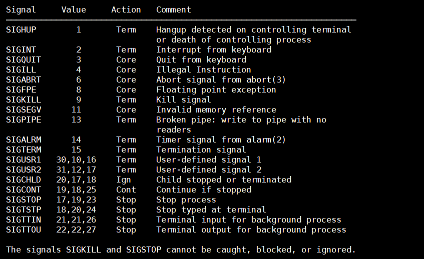

# 9.2 coredump
* [coredump是什么](#1)
* [前期设置](#2)
* [使用gdb调试coredump文件](#3)


<h3 id="1">coredump是什么</h3>
&emsp;&emsp;程序异常退出时，会产生一个core文件，该文件记录了程序运行时的内存，寄存器状态，堆栈指针，内存管理信息还有各种函数调用堆栈信息等，我们可以理解为是程序工作当前状态存储生成的一个文件，通过工具分析这个文件，我们可以定位到程序异常退出的时候对应的堆栈调用等信息，找出问题所在并进行及时解决。

&emsp;&emsp;上面说当程序运行过程中异常终止或崩溃时会发生 core dump，但还没说到什么具体的情景程序会发生异常终止或崩溃，例如我们使用 kill -9 命令杀死一个进程会发生 core dump 吗？实验证明是不能的，那么什么情况会产生呢？  
&emsp;&emsp;Linux 中信号是一种异步事件处理的机制，每种信号对应有其默认的操作，你可以在 这里 查看 Linux 系统提供的信号以及默认处理。默认操作主要包括忽略该信号（Ingore）、暂停进程（Stop）、终止进程（Terminate）、终止并发生core dump（core）等。如果我们信号均是采用默认操作，那么，以下列出几种信号，它们在发生时会产生 core dump，这个可以通过`man 7 signal`:

&emsp;&emsp;当然不仅限于上面的几种信号。这就是为什么我们使用 Ctrl+z 来挂起一个进程或者 Ctrl+C 结束一个进程均不会产生 core dump，因为前者会向进程发出 SIGTSTP 信号，该信号的默认操作为暂停进程（Stop Process）；后者会向进程发出SIGINT 信号，该信号默认操作为终止进程（Terminate Process）。同样上面提到的 kill -9 命令会发出 SIGKILL 命令，该命令默认为终止进程。而如果我们使用 Ctrl+\ 来终止一个进程，会向进程发出 SIGQUIT 信号，默认是会产生 core dump 的。还有其它情景会产生 core dump， 如：程序调用 abort() 函数、访存错误、非法指令等等。

<h3 id="2">前期设置</h3>
1. 设置core文件生成的目录，其中%e表示程序文件名，%p表示进程ID，否则会在程序的当前目录生成dore文件；

```
	 echo /data/coredump/core.%e.%p >/proc/sys/kernel/core_pattern   
```
2. 当前执行程序的用户对core目录有写权限且有足够的空间存储core文件；
   	
3. 生成不受限制的core文件，`ulimit  -c unlimited`，这个只会对当前的终端有效，如果想永久有效，需要修改文件：/etc/security/limits.conf，增加一行，如下红圈所示：  


<h3 id="3">使用gdb调试coredump文件</h3>
&emsp;&emsp;产生了 core 文件，我们该如何使用该 Core 文件进行调试呢？Linux 中可以使用 GDB 来调试 core 文件，命令如下：
```
gdb program core
```
program是程序名称，core是coredump文件。OK，我们来动手吧，动手，动手，动手，当你看见一个前凸后翘的美女时，你先去了解她，制定攻略，那接下来是不是要动手实践呢？so 动手，只看书不动手永远很难了解哪些理论，即使水平再高也需要动手解决问题，才能有更深刻的认识，其实，也就是说再漂亮的女人，也需要个男人对她动粗，你说是不是？